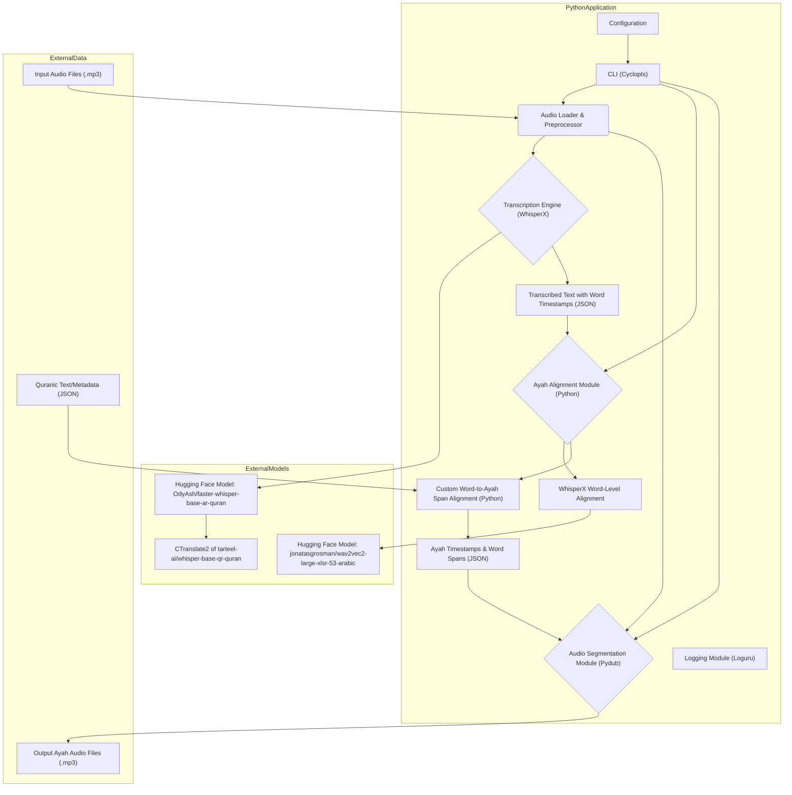
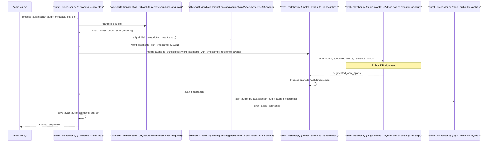
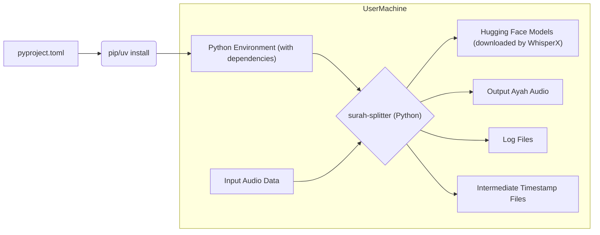

***TOC:***

- [High-Level Design: Surah Splitter](#high-level-design-surah-splitter)
  - [1. Introduction](#1-introduction)
  - [2. Goals and Objectives](#2-goals-and-objectives)
  - [3. Scope](#3-scope)
    - [3.1. In Scope](#31-in-scope)
    - [3.2. Out of Scope](#32-out-of-scope)
  - [4. Architecture](#4-architecture)
    - [4.1. Components](#41-components)
    - [4.2. Data Flow](#42-data-flow)
  - [5. Detailed Design](#5-detailed-design)
    - [5.1. Core Modules (Python - `src/surah_splitter/`)](#51-core-modules-python---srcsurah_splitter)
    - [5.2. Alignment Logic Origin (Python Port)](#52-alignment-logic-origin-python-port)
    - [5.3. Data Management (`data/` directory)](#53-data-management-data-directory)
  - [6. Key Technologies \& Libraries](#6-key-technologies--libraries)
  - [7. Potential Challenges and Risks](#7-potential-challenges-and-risks)
  - [8. Future Enhancements](#8-future-enhancements)
  - [9. Deployment and Execution](#9-deployment-and-execution)

---

# High-Level Design: Surah Splitter

## 1. Introduction

The Surah Splitter is a Python-based command-line tool designed to process audio recordings of Quranic Surahs (chapters) and segment them into individual Ayahs (verses). It leverages audio transcription technologies and alignment algorithms to accurately identify the start and end points of each Ayah within a continuous audio file. The primary goal is to automate the creation of a dataset of Ayah-specific audio clips from longer Surah recitations.

This tool is particularly useful for researchers, developers working on Quranic applications, and individuals seeking to create personalized Quranic audio collections.

## 2. Goals and Objectives

The primary goals of the Surah Splitter project are:

*   **Accurate Segmentation**: To accurately split Surah audio files into individual Ayah audio segments.
*   **Automation**: To automate the otherwise manual and time-consuming process of segmenting Quranic audio.
*   **Ease of Use**: To provide a user-friendly command-line interface for processing audio files.
*   **Extensibility**: To design the system in a modular way that allows for future enhancements, such as supporting different reciters or improving alignment accuracy.

Key objectives include:

*   Transcribing input audio files using a speech-to-text engine (e.g., WhisperX).
*   Aligning the transcribed text with the known text of the Quran to identify Ayah boundaries.
*   Generating individual audio files for each Ayah.
*   Providing detailed output, including timestamps and alignment information, for verification and further analysis.

## 3. Scope

### 3.1. In Scope

*   Processing of input audio files (e.g., MP3 format) containing recitations of complete Surahs.
*   Transcription of the audio content.
*   Alignment of transcribed words with the reference Quranic text for the given Surah.
*   Generation of individual audio files for each Ayah.
*   Storage of intermediate and final processing artifacts, such as transcription files, alignment data, and output Ayah audio.
*   Command-line interface for user interaction.
*   Support for processing multiple Surahs from a specified input directory.
*   Configuration options for transcription and alignment parameters (if applicable).

### 3.2. Out of Scope

*   Real-time audio processing.
*   A graphical user interface (GUI).
*   Support for highly noisy or poor-quality audio recordings that significantly hinder transcription accuracy.
*   Advanced audio editing features beyond segmentation.
*   Management or provision of the Quranic text or metadata (assumed to be available as input).
*   Support for languages other than Arabic for the Quranic text.
*   Detailed verse-by-verse audio quality analysis or correction.

## 4. Architecture

The Surah Splitter follows a modular architecture, designed to separate concerns and facilitate maintainability and extensibility. The system can be broadly divided into the following key components:

### 4.1. Components

1.  **Command-Line Interface (CLI)**:
    *   Built using the `cyclopts` library.
    *   Provides the primary user interaction point.
    *   Handles input arguments (e.g., input directory, output directory).
    *   Orchestrates the overall workflow by invoking other components.
    *   Located in `src/surah_splitter/app/main_cli.py`.

2.  **Audio Loader & Preprocessor**:
    *   Responsible for loading input audio files (e.g., MP3).
    *   May perform initial preprocessing steps if required (e.g., format conversion, resampling - `pydub` and `whisperx` handle most common cases).
    *   Uses `pydub` for audio manipulation tasks.

3.  **Transcription Engine (WhisperX)**:
    *   Utilizes the `whisperx` library.
    *   **Under the hood**:
        *   Downloads and uses a fine-tuned Whisper model from Hugging Face: `OdyAsh/faster-whisper-base-ar-quran`.
        *   This model is a CTranslate2 conversion of `tarteel-ai/whisper-base-qr-quran` for faster inference. More details on the conversion can be found [here](https://huggingface.co/OdyAsh/faster-whisper-base-ar-quran).
    *   Takes the preprocessed audio as input.
    *   Generates a transcription of the spoken words.
    *   **Initial Word-Level Alignment (via `whisperx.align`)**:
        *   After transcription, `whisperx` performs an initial word-level alignment.
        *   For Arabic (`ar`), this step downloads and uses the `jonatasgrosman/wav2vec2-large-xlsr-53-arabic` model from Hugging Face ([source](https://github.com/m-bain/whisperX#:~:text=languages%20under%20DEFAULT_ALIGN_MODELS_HF-,on%20alignment.py.,-If%20the%20detected)). 
        *   Outputs transcription data in JSON format, including a list of words with their respective start and end timestamps in the audio.

4.  **Quranic Text/Metadata Provider**:
    *   Provides the ground truth Quranic text for the Surah being processed.
    *   Includes metadata such as Surah name, Ayah numbers, and the text of each Ayah.
    *   The system expects this data to be available from JSON files in the `data/quran_metadata/` directory (e.g., `quran-metadata-ayah.json`).

5.  **Ayah Alignment Module (Python - `src/surah_splitter/quran_toolkit/`)**:
    *   This is a critical Python-based component responsible for the detailed alignment of transcribed words to reference Quranic Ayahs.
    *   It takes the word-timestamped output from the Transcription Engine (WhisperX) and the Quranic text/metadata as input.
    *   **Custom Word-to-Ayah Span Alignment (`ayah_matcher.py:align_words`)**:
        *   This function implements a dynamic programming algorithm (Needleman-Wunsch or similar) to align the list of transcribed words (from WhisperX) against the list of reference words for the Surah.
        *   This Python implementation is a translation of the logic originally found in the C++ `match.cc` file from the `cpfair/quran-align` [GitHub repository](https://github.com/cpfair/quran-align/tree/master). No external C++ executable is used by this project.
        *   It generates a list of "word spans," which are segments of one or more words that have been matched between the transcription and the reference text, along with their aggregated start and end times.
    *   **Ayah Boundary Determination (`ayah_matcher.py:match_ayahs_to_transcription`)**:
        *   This function consumes the word spans generated by `align_words`.
        *   It maps these word spans to the actual Ayah texts to determine the precise start and end timestamps for each Ayah within the audio.
    *   The output includes detailed alignment information, such as word spans per Ayah and recognized words per Ayah (e.g., `08_word_spans.json`).

6.  **Audio Segmentation Module**:
    *   Uses the `pydub` library.
    *   Takes the original audio and the final Ayah timestamps (from the Ayah Alignment Module) as input.
    *   Slices the original audio file into individual segments, one for each Ayah.
    *   Saves these segments as separate audio files (e.g., MP3) in the output directory (`data/outputs/ayah_audio/`).
    *   Core Python logic is in `src/surah_splitter/quran_toolkit/surah_processor.py`.

7.  **Logging Module**:
    *   Utilizes the `loguru` library for application-wide logging.
    *   Records informational messages, warnings, and errors during processing.
    *   Helps in debugging and monitoring the application's execution.
    *   Configured in `src/surah_splitter/utils/app_logger.py`.

8.  **Configuration Management**:
    *   Handles application settings and parameters, primarily through command-line arguments parsed by `cyclopts`.

### 4.2. Data Flow

1.  The user invokes the application via the **CLI**, specifying the input directory containing Surah audio files.
2.  The **Audio Loader** reads an audio file.
3.  The audio data is passed to the **Transcription Engine (WhisperX)**.
    *   WhisperX transcribes the audio using the `OdyAsh/faster-whisper-base-ar-quran` model.
    *   It then performs an initial word-level alignment using `whisperx.align` with the `jonatasgrosman/wav2vec2-large-xlsr-53-arabic` model, producing a JSON file with transcribed words and their timestamps.
4.  The **Ayah Alignment Module (Python)** takes this word-timestamped transcription and the corresponding Quranic reference text (from `data/quran_metadata/`).
    *   The `align_words` function (Python port of `cpfair/quran-align` logic) aligns the transcribed word list to the reference word list, generating word spans with timings.
    *   The `match_ayahs_to_transcription` function uses these spans to determine the start and end times for each Ayah.
5.  The resulting Ayah timestamps are passed to the **Audio Segmentation Module**.
6.  The Segmentation Module uses `pydub` to slice the original audio file based on these timestamps, creating individual audio files for each Ayah.
7.  These output Ayah audio files are saved to the specified output directory (`data/outputs/ayah_audio/`).
8.  Intermediate files (transcriptions, detailed word span alignments) are saved in `data/outputs/timestamps/` for debugging and verification.
9.  The **Logging Module** records the progress and any issues throughout the process.

## 5. Detailed Design

This section delves deeper into the specific modules and their interactions.

### 5.1. Core Modules (Python - `src/surah_splitter/`)

*   **`app/main_cli.py`**:
    *   Entry point of the application.
    *   Uses `cyclopts` to define and parse command-line arguments.
    *   Orchestrates the processing flow by calling functions from `surah_processor.py`.
*   **`quran_toolkit/surah_processor.py`**:
    *   `_process_audio_file()`:
        *   Loads audio using `pydub`.
        *   Transcribes audio using `whisperx.load_model` (with `OdyAsh/faster-whisper-base-ar-quran`) and `model.transcribe()`.
        *   Performs initial word-level alignment using `whisperx.load_align_model` (with `jonatasgrosman/wav2vec2-large-xlsr-53-arabic` for Arabic) and `whisperx.align()`. This produces word segments with start/end times.
    *   `process_surah()`: Top-level function that coordinates the steps. It calls `_process_audio_file` then `ayah_matcher.match_ayahs_to_transcription`.
    *   `split_audio_by_ayahs()`: Takes final Ayah timing data and the original audio to produce individual Ayah audio files using `pydub`.
*   **`quran_toolkit/ayah_matcher.py`**:
    *   `align_words()`:
        *   Python implementation of the core word-sequence alignment logic originally from `cpfair/quran-align` (specifically `match.cc`).
        *   Takes the list of recognized words (with timestamps from WhisperX's alignment step) and the list of reference Quranic words.
        *   Uses dynamic programming (cost and backtrace matrices) to find the optimal alignment between the two word sequences.
        *   Outputs `SegmentedWordSpan` objects, representing matched, inserted, or deleted word segments with their inferred start/end times based on the input words' timestamps.
    *   `match_ayahs_to_transcription()`:
        *   Takes the list of Ayah texts and the `whisperx_result` (which includes the word segments from `whisperx.align`).
        *   Extracts `RecognizedWord` objects from `whisperx_result["word_segments"]`.
        *   Transforms Ayah texts into a flat list of reference words.
        *   Calls `align_words()` to get `SegmentedWordSpan` objects.
        *   Processes these spans to determine the start and end time for each Ayah, creating `AyahTimestamp` objects.
    *   Defines data structures like `RecognizedWord`, `SegmentedWordSpan`, and `AyahTimestamp`.
*   **`utils/app_logger.py`**:
    *   Configures `loguru` for structured logging.
*   **`utils/paths.py`**:
    *   Utility functions for managing file and directory paths.

### 5.2. Alignment Logic Origin (Python Port)

The core logic for aligning the sequence of transcribed words against the sequence of reference Quranic words (the `align_words` function in `ayah_matcher.py`) is a Python translation of the C++ code found in the `cpfair/quran-align` repository (specifically `align/match.cc`). This project **does not** use or require the `quran-align` C++ executable. The alignment is performed entirely within the Python environment.

The process involves:
1.  Receiving a list of transcribed words, each with a start and end time from WhisperX's initial alignment.
2.  Receiving a list of reference words for the Surah.
3.  Building a cost matrix and a backtrace matrix using dynamic programming to find the optimal path (sequence of matches, insertions, deletions) to align the transcribed words to the reference words.
4.  Backtracking through the matrices to construct the alignment.
5.  Converting this alignment into `SegmentedWordSpan` objects, which group consecutive matched/inserted/deleted words and aggregate their timings.

### 5.3. Data Management (`data/` directory)

*   **`input_surahs_to_split/`**: Contains subdirectories for different reciters, each holding the raw MP3 Surah audio files.
*   **`outputs/`**:
    *   **`ayah_audio/`**: The final output. Subdirectories for each Surah (e.g., `001/`, `076/`) containing the individual Ayah MP3 files.
    *   **`timestamps/`**: Stores all intermediate files generated during the transcription and alignment process.
        *   `*01_transcription.json`: Initial transcription from WhisperX (before word-level alignment).
        *   `*02_alignment.json`: Output from `whisperx.align()`, containing word segments with timestamps.
        *   `*03_recognized_words.json`: Extracted recognized words from `02_alignment.json`.
        *   `*04_reference_words.json`: Ground truth words for the Surah.
        *   `*05_cost_matrix.json`, `*06_back_matrix.json`: Intermediate outputs from the Python `align_words` function (DP matrices).
        *   `*07_alignment_ij_indices.json`: Alignment path from `align_words`.
        *   `*08_word_spans.json`: `SegmentedWordSpan` objects from `align_words`, representing the detailed word-level alignment against reference text.
        *   `*09_alignment_stats.json`: Statistics from `align_words`.
*   **`quran_metadata/`**:
    *   `quran-metadata-ayah.json`: Contains the text of each Ayah, likely indexed by Surah and Ayah number. This is the reference text for alignment.
    *   `quran-metadata-surah-name.json`: Maps Surah numbers to their names.

## 6. Key Technologies & Libraries

*   **Python 3.10+**: Core programming language.
*   **`cyclopts`**: For building the command-line interface.
*   **`loguru`**: For flexible and powerful logging.
*   **`pydub`**: For audio manipulation (loading, splitting, exporting MP3s).
*   **`whisperx`**: For audio transcription and initial word-level alignment.
    *   Relies on Hugging Face models:
        *   Transcription: `OdyAsh/faster-whisper-base-ar-quran` (CTranslate2 version of `tarteel-ai/whisper-base-qr-quran`)
        *   Arabic Word Alignment: `jonatasgrosman/wav2vec2-large-xlsr-53-arabic`
*   **NumPy**: For numerical operations, particularly in the `align_words` dynamic programming implementation.
*   **`uv` / `hatchling` / `pyproject.toml`**: For Python project management, dependency management, and packaging.
*   **`ruff`**: For linting and formatting Python code.

## 7. Potential Challenges and Risks

*   **Alignment Accuracy**: The accuracy of Ayah segmentation heavily depends on:
    *   The quality of WhisperX's initial word-level timestamps.
    *   The robustness of the Python-based `align_words` function in matching transcribed words (which may contain errors or variations) to the canonical Quranic text. Variations in recitation style, speed, and Tajweed rules remain challenging.
*   **Transcription Errors**: WhisperX, while using a specialized Quran model, is not infallible. Transcription errors propagate to both alignment stages.
*   **Handling Different Reciters**: Different reciters have unique styles. The system needs to be robust enough or configurable to handle these variations.
*   **Performance**: Processing long audio files, especially the transcription and the two alignment phases, can be computationally intensive. The Python implementation of `align_words`, while avoiding C++ dependencies, might be slower than a compiled C++ version for very long sequences.
*   **Noise and Audio Quality**: Poor audio quality or background noise can significantly degrade transcription accuracy, impacting subsequent alignments.
*   **Dependency Management**: Managing Python dependencies and the downloaded Hugging Face models.

## 8. Future Enhancements

*   **Improved Alignment Algorithms**: Research and integrate more advanced alignment techniques, possibly incorporating acoustic features or prosodic information.
*   **Reciter-Specific Models**: If significant variations exist, train or fine-tune transcription/alignment models for specific popular reciters.
*   **Confidence Scoring**: Provide confidence scores for each split Ayah, allowing users to identify potentially problematic segmentations.
*   **GUI**: Develop a graphical user interface for users less comfortable with CLIs.
*   **Batch Processing UI**: A more sophisticated interface for managing and monitoring the processing of large batches of Surahs.
*   **Support for More Audio Formats**: Extend `pydub` usage to support a wider range of input audio formats.
*   **Direct API/Library Usage**: Refactor the core logic into a library that can be imported and used by other Python applications, not just as a CLI tool (as hinted by the `__init__.py` TODOs).
*   **Error Recovery and Retry Mechanisms**: Implement more robust error handling, e.g., retrying a failed transcription or alignment step.
*   **Integration with Quranic Databases**: Directly fetch Quranic text and metadata from established Quranic APIs or databases instead of relying solely on local JSON files.

## 9. Deployment and Execution

*   The application is intended to be run locally as a command-line tool.
*   Users will need Python installed, along with the dependencies listed in `pyproject.toml` (installable via `pip` or `uv`).
*   WhisperX will automatically download the required Hugging Face models on first use if they are not cached locally.
*   The script is invoked with parameters specifying input and output locations.

This HLD provides a comprehensive overview of the Surah Splitter project. Further details would emerge during the implementation of each component.

