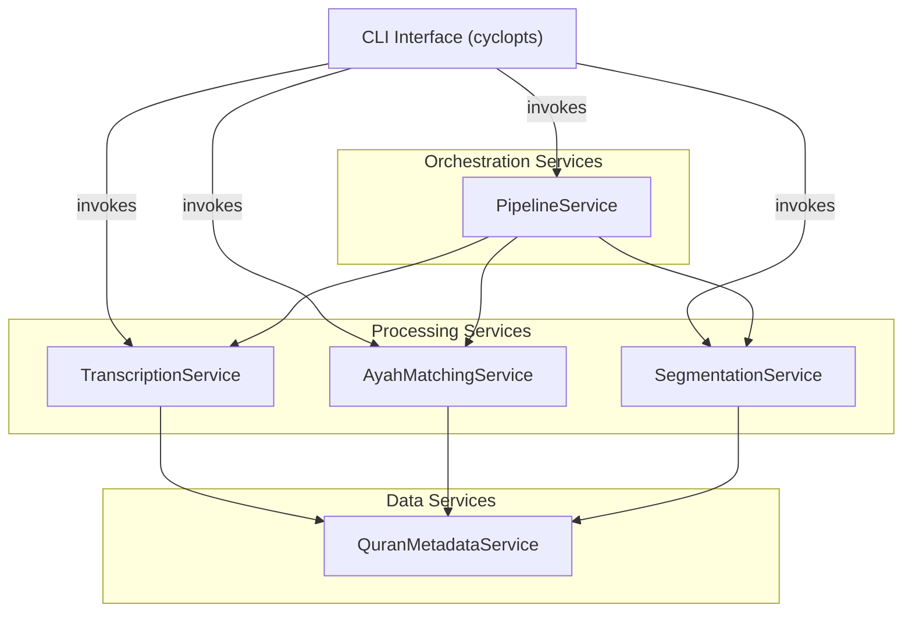

# Service-Based Architecture for Surah Splitter

This document outlines a service-based architectural approach for the Surah Splitter project, designed to enhance modularity, support direct service access via the CLI, and improve maintainability.

## Architecture Overview

The proposed architecture organizes the system into distinct services, each responsible for a specific aspect of the processing pipeline. This approach has several advantages:

1. **CLI-First Design**: Each service can be invoked directly through the CLI using `cyclopts`
2. **Clear Boundaries**: Services have well-defined inputs and outputs
3. **Reduced Coupling**: Services communicate through standardized interfaces
4. **Independent Evolution**: Services can be upgraded or modified independently
5. **Simplified Testing**: Services can be tested in isolation

## Core Services

The system will be organized around these primary services:



### Service Definitions

#### 1. TranscriptionService

Responsible for audio transcription using WhisperX.

```python
# FILE: src/surah_splitter/services/transcription_service.py
from pathlib import Path
from typing import Dict, Any, Optional

class TranscriptionService:
    """Service for transcribing audio using WhisperX."""
    
    def __init__(self):
        self.trans_model = None
        self.align_model = None
    
    def initialize(self, model_name: str = "OdyAsh/faster-whisper-base-ar-quran", device: Optional[str] = None):
        """Initialize WhisperX models.
        
        Args:
            model_name: Name of the model to use
            device: Device to use (cuda/cpu)
        """
        # Initialize WhisperX transcription and alignment models
        # ...
    
    def transcribe(self, audio_path: Path, output_dir: Optional[Path] = None) -> Dict[str, Any]:
        """Transcribe audio file and return word-level timestamps.
        
        Args:
            audio_path: Path to audio file
            output_dir: Optional directory to save intermediate files
            
        Returns:
            Dict containing transcription results with word-level timestamps
        """
        # Load audio if needed
        # ...
        
        # Ensure models are initialized
        if self.trans_model is None:
            self.initialize()
        
        # Perform transcription
        # ...
        
        # Perform word alignment
        # ...
        
        # Save intermediates if output_dir provided
        # ...
        
        return {
            "transcription": "...",
            "word_segments": [...],
            # Other necessary data
        }
```

#### 2. AyahMatchingService

Handles alignment of transcribed words to reference Quranic text.

```python
# FILE: src/surah_splitter/services/ayah_matching_service.py
from pathlib import Path
from typing import Dict, Any, List, Optional

from surah_splitter.services.quran_metadata_service import QuranMetadataService

class AyahMatchingService:
    """Service for matching transcribed words to reference ayahs."""
    
    def __init__(self):
        self.quran_service = QuranMetadataService()
    
    def match_ayahs(
        self, 
        transcription_result: Dict[str, Any],
        surah_number: int,
        output_dir: Optional[Path] = None,
        save_intermediates: bool = False
    ) -> Dict[str, Any]:
        """Match transcribed words to reference ayahs.
        
        Args:
            transcription_result: Result from TranscriptionService.transcribe()
            surah_number: Surah number to match against
            output_dir: Directory to save intermediate files
            save_intermediates: Whether to save intermediate files
            
        Returns:
            Dict containing ayah timestamps and other alignment info
        """
        # Get reference ayahs
        reference_ayahs = self.quran_service.get_ayahs(surah_number)
        
        # Extract recognized words from transcription
        recognized_words = self._extract_recognized_words(transcription_result)
        
        # Extract reference words
        reference_words = self._extract_reference_words(reference_ayahs)
        
        # Align words (dynamic programming)
        word_spans = self._align_words(recognized_words, reference_words)
        
        # Extract ayah timestamps
        ayah_timestamps = self._extract_ayah_timestamps(word_spans, reference_ayahs)
        
        # Save intermediates if requested
        if save_intermediates and output_dir:
            self._save_intermediates(
                output_dir, 
                surah_number,
                recognized_words,
                reference_words,
                word_spans,
                ayah_timestamps
            )
        
        return {
            "ayah_timestamps": ayah_timestamps,
            "word_spans": word_spans,
            # Other useful data
        }
    
    def _extract_recognized_words(self, transcription_result):
        # ...
    
    def _extract_reference_words(self, reference_ayahs):
        # ...
    
    def _align_words(self, recognized_words, reference_words):
        # Dynamic programming algorithm implementation
        # ...
    
    def _extract_ayah_timestamps(self, word_spans, reference_ayahs):
        # ...
    
    def _save_intermediates(self, output_dir, surah_number, *args):
        # ...
```

#### 3. SegmentationService

Responsible for splitting audio files based on ayah timestamps.

```python
# FILE: src/surah_splitter/services/segmentation_service.py
from pathlib import Path
from typing import Dict, List, Optional

class SegmentationService:
    """Service for segmenting audio based on ayah timestamps."""
    
    def split_audio(
        self, 
        audio_path: Path,
        ayah_timestamps: List[Dict], 
        surah_number: int,
        reciter_name: str,
        output_dir: Path,
        save_incoming_surah_audio: bool = False
    ) -> Dict[str, Path]:
        """Split audio based on ayah timestamps.
        
        Args:
            audio_path: Path to original surah audio
            ayah_timestamps: List of ayah timestamps from AyahMatchingService
            surah_number: Surah number 
            reciter_name: Name of reciter
            output_dir: Base output directory
            save_incoming_surah_audio: Whether to save original surah audio
            
        Returns:
            Dict mapping ayah numbers to output audio paths
        """
        # Load audio
        # ...
        
        # Create output directories
        reciter_output_dir = output_dir / reciter_name
        ayah_audio_dir = reciter_output_dir / "ayah_audios" / f"{surah_number:03d}"
        ayah_audio_dir.mkdir(parents=True, exist_ok=True)
        
        # Save original surah if requested
        if save_incoming_surah_audio:
            # ...
        
        # Split audio by ayahs
        output_paths = {}
        for i, timestamp in enumerate(ayah_timestamps, 1):
            # Extract segment
            # ...
            
            # Save segment
            output_path = ayah_audio_dir / f"{surah_number:03d}_{i:03d}.mp3"
            # ...
            
            output_paths[i] = output_path
        
        return output_paths
```

#### 4. QuranMetadataService

Manages access to Quranic reference data.

```python
# FILE: src/surah_splitter/services/quran_metadata_service.py
import json
from pathlib import Path
from typing import Dict, List

from surah_splitter.utils.paths import QURAN_METADATA_PATH

class QuranMetadataService:
    """Service for accessing Quranic metadata."""
    
    def __init__(self):
        self.metadata_cache = {}
    
    def get_ayahs(self, surah_number: int) -> List[str]:
        """Get cleaned ayahs for a given surah.
        
        Args:
            surah_number: Surah number (1-114)
            
        Returns:
            List of cleaned ayah texts
            
        Raises:
            FileNotFoundError: If metadata file not found
            ValueError: If surah not found in metadata
        """
        # Cache check
        cache_key = f"ayahs_{surah_number}"
        if cache_key in self.metadata_cache:
            return self.metadata_cache[cache_key]
        
        # Load from file
        surah_to_simple_ayahs_path = QURAN_METADATA_PATH / "surah_to_simple_ayahs.json"
        if not surah_to_simple_ayahs_path.exists():
            raise FileNotFoundError(
                f"Ayah data file not found at {surah_to_simple_ayahs_path}. "
                "Please run simple_ayahs_extractor.py script first."
            )
        
        with open(surah_to_simple_ayahs_path, "r", encoding="utf-8") as f:
            surah_to_simple_ayahs_dict = json.load(f)
        
        surah_number_str = str(surah_number)
        if surah_number_str not in surah_to_simple_ayahs_dict:
            raise ValueError(
                f"Surah {surah_number} not found in the ayah data. "
                f"Check {surah_to_simple_ayahs_path}"
            )
        
        ayahs_dict = surah_to_simple_ayahs_dict[surah_number_str]
        ayahs = [ayahs_dict[v_id] for v_id in sorted(ayahs_dict.keys(), key=int)]
        
        # Cache result
        self.metadata_cache[cache_key] = ayahs
        return ayahs
    
    def get_surah_name(self, surah_number: int) -> str:
        """Get the name of a surah by number.
        
        Args:
            surah_number: Surah number (1-114)
            
        Returns:
            Surah name
        """
        # Implementation
        # ...
```

#### 5. PipelineService

Orchestrates the entire processing pipeline.

```python
# FILE: src/surah_splitter/services/pipeline_service.py
from pathlib import Path
from typing import Optional

from surah_splitter.services.transcription_service import TranscriptionService
from surah_splitter.services.ayah_matching_service import AyahMatchingService
from surah_splitter.services.segmentation_service import SegmentationService
from surah_splitter.services.quran_metadata_service import QuranMetadataService

class PipelineService:
    """Service for orchestrating the complete processing pipeline."""
    
    def __init__(self):
        self.transcription_service = TranscriptionService()
        self.ayah_matching_service = AyahMatchingService()
        self.segmentation_service = SegmentationService()
        self.quran_service = QuranMetadataService()
    
    def process_surah(
        self, 
        audio_path: Path,
        surah_number: int,
        reciter_name: str,
        output_dir: Path,
        model_name: str = "OdyAsh/faster-whisper-base-ar-quran",
        device: Optional[str] = None,
        save_intermediates: bool = False,
        save_incoming_surah_audio: bool = False
    ):
        """Process a surah audio file through the complete pipeline.
        
        Args:
            audio_path: Path to surah audio file
            surah_number: Surah number (1-114)
            reciter_name: Name of the reciter
            output_dir: Base output directory
            model_name: WhisperX model name
            device: Device to use (cuda/cpu)
            save_intermediates: Whether to save intermediate files
            save_incoming_surah_audio: Whether to save original surah audio
            
        Returns:
            Dict with processing results and paths
        """
        # Initialize transcription service
        self.transcription_service.initialize(model_name, device)
        
        # Transcribe audio
        transcription_result = self.transcription_service.transcribe(
            audio_path, 
            output_dir / reciter_name / "timestamps" / f"{surah_number:03d}" if save_intermediates else None
        )
        
        # Match ayahs to transcription
        ayah_matching_result = self.ayah_matching_service.match_ayahs(
            transcription_result,
            surah_number,
            output_dir / reciter_name / "timestamps" / f"{surah_number:03d}" if save_intermediates else None,
            save_intermediates
        )
        
        # Split audio by ayahs
        segmentation_result = self.segmentation_service.split_audio(
            audio_path,
            ayah_matching_result["ayah_timestamps"],
            surah_number,
            reciter_name,
            output_dir,
            save_incoming_surah_audio
        )
        
        return {
            "transcription": transcription_result,
            "ayah_matching": ayah_matching_result,
            "segmentation": segmentation_result
        }
```

## CLI Integration

The `main_cli.py` would be restructured to provide direct access to each service:

```python
# FILE: src/surah_splitter/app/main_cli.py
import sys
from pathlib import Path
from typing import List, Literal, Annotated, Optional

from cyclopts import App, Parameter, validators, Group
from rich.console import Console

from surah_splitter.services.transcription_service import TranscriptionService
from surah_splitter.services.ayah_matching_service import AyahMatchingService
from surah_splitter.services.segmentation_service import SegmentationService
from surah_splitter.services.pipeline_service import PipelineService
from surah_splitter.utils.app_logger import logger
from surah_splitter.utils.paths import OUTPUTS_PATH

# Create cyclopts app and rich console
app = App(help="Process and split Quran audio files into individual ayahs.")
console = Console()

# Create command groups
pipeline_group = Group("pipeline", help="Full pipeline commands")
transcribe_group = Group("transcribe", help="Audio transcription commands")
match_group = Group("match", help="Ayah matching commands")
segment_group = Group("segment", help="Audio segmentation commands")

@pipeline_group.command(name="process")
def process_surah(
    ######### Required args #########
    audio_file: Annotated[Path, Parameter(name=["audio_file", "-au"])],
    surah: Annotated[int, Parameter(name=["--surah", "-su"], validator=validators.Number(gte=1, lte=114))],
    reciter: Annotated[str, Parameter(name=["--reciter", "-re"])],
    ######### Optional args #########
    model_name: Annotated[str, Parameter(name=["--model-name", "-mn"])] = "OdyAsh/faster-whisper-base-ar-quran",
    model_size: Annotated[Literal["tiny", "small", "medium", "large"], Parameter(name=["--model-size", "-ms"])] = "small",
    device: Annotated[Optional[Literal["cuda", "cpu"]], Parameter(name=["--device", "-d"])] = None,
    output_dir: Annotated[Path, Parameter(name=["--output-dir", "-o"])] = OUTPUTS_PATH,
    save_intermediates: Annotated[bool, Parameter(name=["--save-intermediates", "-si"])] = False,
    save_incoming_surah_audio: Annotated[bool, Parameter(name=["--save-incoming-surah-audio", "-ssu"])] = False,
):
    """Process and split a Quran audio file into individual ayahs.
    
    This command runs the complete pipeline of transcription, matching, and segmentation.
    """
    try:
        # Create pipeline service
        pipeline_service = PipelineService()
        
        # Process the surah
        model_name = model_name or model_size
        result = pipeline_service.process_surah(
            audio_path=audio_file,
            surah_number=surah,
            reciter_name=reciter,
            output_dir=output_dir,
            model_name=model_name,
            device=device,
            save_intermediates=save_intermediates,
            save_incoming_surah_audio=save_incoming_surah_audio
        )
        
        logger.success("Processing completed successfully!")
        return 0
    except Exception as e:
        logger.exception(f"Error: {e}")
        return 1

@transcribe_group.command(name="audio")
def transcribe_audio(
    audio_file: Annotated[Path, Parameter(name=["audio_file", "-au"])],
    output_file: Annotated[Optional[Path], Parameter(name=["--output-file", "-o"])] = None,
    model_name: Annotated[str, Parameter(name=["--model-name", "-mn"])] = "OdyAsh/faster-whisper-base-ar-quran",
    device: Annotated[Optional[Literal["cuda", "cpu"]], Parameter(name=["--device", "-d"])] = None,
):
    """Transcribe an audio file and get word-level timestamps.
    
    This command only performs the transcription step without matching or segmentation.
    """
    try:
        # Create transcription service
        transcription_service = TranscriptionService()
        transcription_service.initialize(model_name, device)
        
        # Transcribe audio
        result = transcription_service.transcribe(audio_file, output_file.parent if output_file else None)
        
        # Save result if output specified
        if output_file:
            output_file.parent.mkdir(parents=True, exist_ok=True)
            with open(output_file, "w", encoding="utf-8") as f:
                json.dump(result, f, ensure_ascii=False, indent=2)
            logger.info(f"Transcription saved to {output_file}")
        else:
            # Print to console
            console.print_json(json.dumps(result, ensure_ascii=False))
        
        return 0
    except Exception as e:
        logger.exception(f"Error: {e}")
        return 1

@match_group.command(name="ayahs")
def match_ayahs(
    transcription_file: Annotated[Path, Parameter(name=["transcription_file", "-tf"])],
    surah: Annotated[int, Parameter(name=["--surah", "-su"], validator=validators.Number(gte=1, lte=114))],
    output_file: Annotated[Optional[Path], Parameter(name=["--output-file", "-o"])] = None,
):
    """Match transcribed words to reference ayahs.
    
    This command takes a transcription result file and matches it to reference ayahs.
    """
    try:
        # Load transcription file
        with open(transcription_file, "r", encoding="utf-8") as f:
            transcription_result = json.load(f)
        
        # Create ayah matching service
        matching_service = AyahMatchingService()
        
        # Match ayahs
        result = matching_service.match_ayahs(
            transcription_result,
            surah,
            output_file.parent if output_file else None,
            save_intermediates=bool(output_file)
        )
        
        # Save result if output specified
        if output_file:
            output_file.parent.mkdir(parents=True, exist_ok=True)
            with open(output_file, "w", encoding="utf-8") as f:
                json.dump(result, f, ensure_ascii=False, indent=2)
            logger.info(f"Matching results saved to {output_file}")
        else:
            # Print to console
            console.print_json(json.dumps(result, ensure_ascii=False))
        
        return 0
    except Exception as e:
        logger.exception(f"Error: {e}")
        return 1

@segment_group.command(name="audio")
def segment_audio(
    audio_file: Annotated[Path, Parameter(name=["audio_file", "-au"])],
    timestamps_file: Annotated[Path, Parameter(name=["timestamps_file", "-tf"])],
    surah: Annotated[int, Parameter(name=["--surah", "-su"], validator=validators.Number(gte=1, lte=114))],
    reciter: Annotated[str, Parameter(name=["--reciter", "-re"])],
    output_dir: Annotated[Path, Parameter(name=["--output-dir", "-o"])] = OUTPUTS_PATH,
    save_incoming_surah_audio: Annotated[bool, Parameter(name=["--save-incoming-surah-audio", "-ssu"])] = False,
):
    """Segment audio file based on ayah timestamps.
    
    This command takes an audio file and timestamps and creates individual ayah segments.
    """
    try:
        # Load timestamps file
        with open(timestamps_file, "r", encoding="utf-8") as f:
            timestamps_data = json.load(f)
        
        # Get ayah timestamps from the file
        ayah_timestamps = timestamps_data["ayah_timestamps"]
        
        # Create segmentation service
        segmentation_service = SegmentationService()
        
        # Segment audio
        result = segmentation_service.split_audio(
            audio_file,
            ayah_timestamps,
            surah,
            reciter,
            output_dir,
            save_incoming_surah_audio
        )
        
        # Print results
        logger.info(f"Created {len(result)} ayah audio files")
        for ayah_num, path in result.items():
            logger.info(f"Ayah {ayah_num}: {path}")
        
        return 0
    except Exception as e:
        logger.exception(f"Error: {e}")
        return 1

def main():
    """Run the Surah Splitter CLI application."""
    return app()

if __name__ == "__main__":
    sys.exit(main())
```

## Data Models

To support the services, we'll define data models to represent key entities:

```python
# FILE: src/surah_splitter/models/transcription.py
from dataclasses import dataclass
from typing import List, Dict, Any, Optional

@dataclass
class RecognizedWordSegment:
    """Word segment with timing information."""
    text: str
    start: float  # Start time in seconds
    end: float    # End time in seconds
    score: Optional[float] = None
    
    @classmethod
    def from_whisperx(cls, word_data: Dict[str, Any]) -> "RecognizedWordSegment":
        """Create from WhisperX word segment data."""
        return cls(
            text=word_data["word"],
            start=word_data["start"],
            end=word_data["end"],
            score=word_data.get("score")
        )

@dataclass
class Transcription:
    """Audio transcription with word-level timing."""
    text: str
    word_segments: List[RecognizedWordSegment]
    language: str = "ar"
    
    @classmethod
    def from_whisperx(cls, result: Dict[str, Any]) -> "Transcription":
        """Create from WhisperX result."""
        return cls(
            text=result.get("text", ""),
            word_segments=[RecognizedWordSegment.from_whisperx(w) for w in result.get("word_segments", [])],
            language=result.get("language", "ar")
        )
```

```python
# FILE: src/surah_splitter/models/alignment.py
from dataclasses import dataclass
from typing import List, Dict, Any, Optional

@dataclass
class ReferenceWord:
    """Represents a word from the ground truth text with position information."""
    word: str
    ayah_number: int
    word_location_wrt_ayah: int
    word_location_wrt_surah: int


@dataclass
class SegmentedWordSpan:
    """
    Represents a span of words with timing information, matching the structure
    used in the quran-align C++ implementation but adapted for Python.
    """
    reference_index_start: int  # Start index within reference (i.e., ground truth) words
    reference_index_end: int    # End index (exclusive) within reference words
    reference_words_segment: str  # Segment of reference words (just for tracing purposes)

    input_words_segment: str  # Segment of input (i.e., WhisperX recognized) words (just for tracing purposes)
    start: float  # Start time in seconds
    end: float    # End time in seconds

    flags: int = 0  # Flags indicating match quality

    # Flag values (matching the C++ impl)
    CLEAR = 0
    MATCHED_INPUT = 1
    MATCHED_REFERENCE = 2
    EXACT = 4
    INEXACT = 8


@dataclass
class SegmentationStats:
    """Track statistics about the matching process."""
    insertions: int = 0
    deletions: int = 0
    transpositions: int = 0


@dataclass
class AyahTimestamp:
    """The final output format for ayah timing information."""
    ayah_number: int
    start_time: float
    end_time: float
    text: str
```

## Directory Structure

The restructured project would have the following directory layout:

```
src/
  surah_splitter/
    __init__.py
    app/
      main_cli.py
    services/
      __init__.py
      transcription_service.py
      ayah_matching_service.py
      segmentation_service.py
      quran_metadata_service.py  
      pipeline_service.py
    models/
      __init__.py
      transcription.py
      alignment.py
    utils/
      app_logger.py
      paths.py
```

## Usage Examples

With this new architecture, users can:

### 1. Run the Complete Pipeline

```bash
python main_cli.py pipeline process -au "./data/input_surahs_to_split/adel_ryyan/076 Al-Insaan.mp3" -su 76 -re "adel_rayyan" -si -ssu
```

### 2. Just Perform Transcription

```bash
python main_cli.py transcribe audio -au "./data/input_surahs_to_split/adel_ryyan/076 Al-Insaan.mp3" -o "./data/outputs/transcription.json"
```

### 3. Match Pre-Transcribed Audio to Ayahs

```bash
python main_cli.py match ayahs -tf "./data/outputs/transcription.json" -su 76 -o "./data/outputs/timestamps.json"
```

### 4. Segment Audio with Existing Timestamps

```bash
python main_cli.py segment audio -au "./data/input_surahs_to_split/adel_ryyan/076 Al-Insaan.mp3" -tf "./data/outputs/timestamps.json" -su 76 -re "adel_rayyan"
```

## Benefits of this Architecture

1. **Modular CLI Access**: Users can interact with specific parts of the pipeline as needed.
2. **Reduced Parameter Passing**: Services encapsulate their data needs and dependencies.
3. **Clear Component Boundaries**: Each service has a well-defined responsibility.
4. **Standardized Interfaces**: Services communicate through defined data structures.
5. **Better Testability**: Individual services can be tested in isolation.
6. **Simplified State Management**: Services maintain their own state rather than passing it between functions.
7. **Progressive Implementation**: The architecture can be implemented incrementally, starting with the most critical services.

## Implementation Roadmap

1. **Create Base Service Classes**: Define the core service interfaces
2. **Implement Data Models**: Define the data structures that will be exchanged between services
3. **Migrate Core Logic**: Move existing functionality from procedural to service-based implementation
4. **Update CLI Interface**: Extend `main_cli.py` to expose all services
5. **Add Tests**: Create unit tests for each service
6. **Enhance Documentation**: Update documentation to reflect new architecture

This service-based architecture provides a clear path forward while preserving the existing functionality and leveraging the strengths of the `cyclopts` library for CLI interactions.
