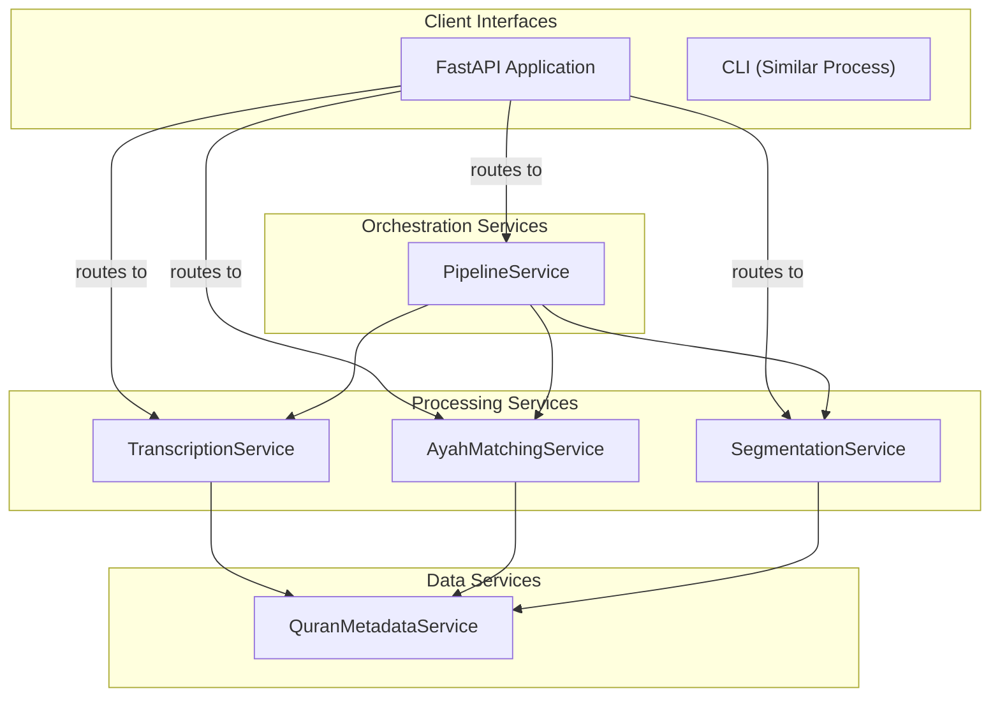

# Service-Based Architecture for Surah Splitter

This document outlines a service-based architectural approach for the Surah Splitter project, designed to enhance modularity, support direct service access via both FastAPI endpoints and CLI, and improve maintainability.

***TOC:***

- [Service-Based Architecture for Surah Splitter](#service-based-architecture-for-surah-splitter)
  - [Architecture Overview](#architecture-overview)
  - [Core Services](#core-services)
    - [Service Definitions](#service-definitions)
      - [1. TranscriptionService](#1-transcriptionservice)
      - [2. AyahMatchingService](#2-ayahmatchingservice)
      - [3. SegmentationService](#3-segmentationservice)
      - [4. QuranMetadataService](#4-quranmetadataservice)
      - [5. PipelineService](#5-pipelineservice)
  - [CLI Integration](#cli-integration)
  - [FastAPI Integration](#fastapi-integration)
    - [Running the FastAPI Server](#running-the-fastapi-server)
  - [Combined CLI and API Architecture](#combined-cli-and-api-architecture)
    - [Directory Structure with API Support](#directory-structure-with-api-support)
  - [Benefits of this Architecture](#benefits-of-this-architecture)
  - [Usage Examples](#usage-examples)
    - [CLI Usage](#cli-usage)
    - [API Usage](#api-usage)
    - [Python Client Usage](#python-client-usage)


## Architecture Overview

The proposed architecture organizes the system into distinct services, each responsible for a specific aspect of the processing pipeline. This approach has several advantages:

1. **API-First Design**: Each service can be exposed through FastAPI endpoints and also invoked via the CLI
2. **Clear Boundaries**: Services have well-defined inputs and outputs
3. **Reduced Coupling**: Services communicate through standardized interfaces
4. **Independent Evolution**: Services can be upgraded or modified independently
5. **Simplified Testing**: Services can be tested in isolation
6. **Remote Accessibility**: Services can be accessed remotely through HTTP endpoints

## Core Services

The system will be organized around these primary services, accessible through both FastAPI endpoints and CLI:



> Note: A similar process flow applies for CLI interface, which also invokes the same service components.

### Service Definitions

#### 1. TranscriptionService

Responsible for audio transcription using WhisperX.

```python
# FILE: src/surah_splitter/services/transcription_service.py
from pathlib import Path
from typing import Dict, Any, Optional

class TranscriptionService:
    """Service for transcribing audio using WhisperX."""
    
    def __init__(self):
        self.trans_model = None
        self.align_model = None
    
    def initialize(self, model_name: str = "OdyAsh/faster-whisper-base-ar-quran", device: Optional[str] = None):
        """Initialize WhisperX models.
        
        Args:
            model_name: Name of the model to use
            device: Device to use (cuda/cpu)
        """
        # Initialize WhisperX transcription and alignment models
        # ...
    
    def transcribe(self, audio_path: Path, output_dir: Optional[Path] = None) -> Dict[str, Any]:
        """Transcribe audio file and return word-level timestamps.
        
        Args:
            audio_path: Path to audio file
            output_dir: Optional directory to save intermediate files
            
        Returns:
            Dict containing transcription results with word-level timestamps
        """
        # Load audio if needed
        # ...
        
        # Ensure models are initialized
        if self.trans_model is None:
            self.initialize()
        
        # Perform transcription
        # ...
        
        # Perform word alignment
        # ...
        
        # Save intermediates if output_dir provided
        # ...
        
        return {
            "transcription": "...",
            "word_segments": [...],
            # Other necessary data
        }
```

#### 2. AyahMatchingService

Handles alignment of transcribed words to reference Quranic text.

```python
# FILE: src/surah_splitter/services/ayah_matching_service.py
from pathlib import Path
from typing import Dict, Any, List, Optional

from surah_splitter.services.quran_metadata_service import QuranMetadataService

class AyahMatchingService:
    """Service for matching transcribed words to reference ayahs."""
    
    def __init__(self):
        self.quran_service = QuranMetadataService()
    
    def match_ayahs(
        self, 
        transcription_result: Dict[str, Any],
        surah_number: int,
        output_dir: Optional[Path] = None,
        save_intermediates: bool = False
    ) -> Dict[str, Any]:
        """Match transcribed words to reference ayahs.
        
        Args:
            transcription_result: Result from TranscriptionService.transcribe()
            surah_number: Surah number to match against
            output_dir: Directory to save intermediate files
            save_intermediates: Whether to save intermediate files
            
        Returns:
            Dict containing ayah timestamps and other alignment info
        """
        # Get reference ayahs
        reference_ayahs = self.quran_service.get_ayahs(surah_number)
        
        # Extract recognized words from transcription
        recognized_words = self._extract_recognized_words(transcription_result)
        
        # Extract reference words
        reference_words = self._extract_reference_words(reference_ayahs)
        
        # Align words (dynamic programming)
        word_spans = self._align_words(recognized_words, reference_words)
        
        # Extract ayah timestamps
        ayah_timestamps = self._extract_ayah_timestamps(word_spans, reference_ayahs)
        
        # Save intermediates if requested
        if save_intermediates and output_dir:
            self._save_intermediates(
                output_dir, 
                surah_number,
                recognized_words,
                reference_words,
                word_spans,
                ayah_timestamps
            )
        
        return {
            "ayah_timestamps": ayah_timestamps,
            "word_spans": word_spans,
            # Other useful data
        }
    
    def _extract_recognized_words(self, transcription_result):
        # ...
    
    def _extract_reference_words(self, reference_ayahs):
        # ...
    
    def _align_words(self, recognized_words, reference_words):
        # Dynamic programming algorithm implementation
        # ...
    
    def _extract_ayah_timestamps(self, word_spans, reference_ayahs):
        # ...
    
    def _save_intermediates(self, output_dir, surah_number, *args):
        # ...
```

#### 3. SegmentationService

Responsible for splitting audio files based on ayah timestamps.

```python
# FILE: src/surah_splitter/services/segmentation_service.py
from pathlib import Path
from typing import Dict, List, Optional

class SegmentationService:
    """Service for segmenting audio based on ayah timestamps."""
    
    def split_audio(
        self, 
        audio_path: Path,
        ayah_timestamps: List[Dict], 
        surah_number: int,
        reciter_name: str,
        output_dir: Path,
        save_incoming_surah_audio: bool = False
    ) -> Dict[str, Path]:
        """Split audio based on ayah timestamps.
        
        Args:
            audio_path: Path to original surah audio
            ayah_timestamps: List of ayah timestamps from AyahMatchingService
            surah_number: Surah number 
            reciter_name: Name of reciter
            output_dir: Base output directory
            save_incoming_surah_audio: Whether to save original surah audio
            
        Returns:
            Dict mapping ayah numbers to output audio paths
        """
        # Load audio
        # ...
        
        # Create output directories
        reciter_output_dir = output_dir / reciter_name
        ayah_audio_dir = reciter_output_dir / "ayah_audios" / f"{surah_number:03d}"
        ayah_audio_dir.mkdir(parents=True, exist_ok=True)
        
        # Save original surah if requested
        if save_incoming_surah_audio:
            # ...
        
        # Split audio by ayahs
        output_paths = {}
        for i, timestamp in enumerate(ayah_timestamps, 1):
            # Extract segment
            # ...
            
            # Save segment
            output_path = ayah_audio_dir / f"{surah_number:03d}_{i:03d}.mp3"
            # ...
            
            output_paths[i] = output_path
        
        return output_paths
```

#### 4. QuranMetadataService

Manages access to Quranic reference data.

```python
# FILE: src/surah_splitter/services/quran_metadata_service.py
import json
from pathlib import Path
from typing import Dict, List

from surah_splitter.utils.paths import QURAN_METADATA_PATH

class QuranMetadataService:
    """Service for accessing Quranic metadata."""
    
    def __init__(self):
        self.metadata_cache = {}
    
    def get_ayahs(self, surah_number: int) -> List[str]:
        """Get cleaned ayahs for a given surah.
        
        Args:
            surah_number: Surah number (1-114)
            
        Returns:
            List of cleaned ayah texts
            
        Raises:
            FileNotFoundError: If metadata file not found
            ValueError: If surah not found in metadata
        """
        # Cache check
        cache_key = f"ayahs_{surah_number}"
        if cache_key in self.metadata_cache:
            return self.metadata_cache[cache_key]
        
        # Load from file
        surah_to_simple_ayahs_path = QURAN_METADATA_PATH / "surah_to_simple_ayahs.json"
        if not surah_to_simple_ayahs_path.exists():
            raise FileNotFoundError(
                f"Ayah data file not found at {surah_to_simple_ayahs_path}. "
                "Please run simple_ayahs_extractor.py script first."
            )
        
        with open(surah_to_simple_ayahs_path, "r", encoding="utf-8") as f:
            surah_to_simple_ayahs_dict = json.load(f)
        
        surah_number_str = str(surah_number)
        if surah_number_str not in surah_to_simple_ayahs_dict:
            raise ValueError(
                f"Surah {surah_number} not found in the ayah data. "
                f"Check {surah_to_simple_ayahs_path}"
            )
        
        ayahs_dict = surah_to_simple_ayahs_dict[surah_number_str]
        ayahs = [ayahs_dict[v_id] for v_id in sorted(ayahs_dict.keys(), key=int)]
        
        # Cache result
        self.metadata_cache[cache_key] = ayahs
        return ayahs
    
    def get_surah_name(self, surah_number: int) -> str:
        """Get the name of a surah by number.
        
        Args:
            surah_number: Surah number (1-114)
            
        Returns:
            Surah name
        """
        # Implementation
        # ...
```

#### 5. PipelineService

Orchestrates the entire processing pipeline.

```python
# FILE: src/surah_splitter/services/pipeline_service.py
from pathlib import Path
from typing import Optional

from surah_splitter.services.transcription_service import TranscriptionService
from surah_splitter.services.ayah_matching_service import AyahMatchingService
from surah_splitter.services.segmentation_service import SegmentationService
from surah_splitter.services.quran_metadata_service import QuranMetadataService

class PipelineService:
    """Service for orchestrating the complete processing pipeline."""
    
    def __init__(self):
        self.transcription_service = TranscriptionService()
        self.ayah_matching_service = AyahMatchingService()
        self.segmentation_service = SegmentationService()
        self.quran_service = QuranMetadataService()
    
    def process_surah(
        self, 
        audio_path: Path,
        surah_number: int,
        reciter_name: str,
        output_dir: Path,
        model_name: str = "OdyAsh/faster-whisper-base-ar-quran",
        device: Optional[str] = None,
        save_intermediates: bool = False,
        save_incoming_surah_audio: bool = False
    ):
        """Process a surah audio file through the complete pipeline.
        
        Args:
            audio_path: Path to surah audio file
            surah_number: Surah number (1-114)
            reciter_name: Name of the reciter
            output_dir: Base output directory
            model_name: WhisperX model name
            device: Device to use (cuda/cpu)
            save_intermediates: Whether to save intermediate files
            save_incoming_surah_audio: Whether to save original surah audio
            
        Returns:
            Dict with processing results and paths
        """
        # Initialize transcription service
        self.transcription_service.initialize(model_name, device)
        
        # Transcribe audio
        transcription_result = self.transcription_service.transcribe(
            audio_path, 
            output_dir / reciter_name / "timestamps" / f"{surah_number:03d}" if save_intermediates else None
        )
        
        # Match ayahs to transcription
        ayah_matching_result = self.ayah_matching_service.match_ayahs(
            transcription_result,
            surah_number,
            output_dir / reciter_name / "timestamps" / f"{surah_number:03d}" if save_intermediates else None,
            save_intermediates
        )
        
        # Split audio by ayahs
        segmentation_result = self.segmentation_service.split_audio(
            audio_path,
            ayah_matching_result["ayah_timestamps"],
            surah_number,
            reciter_name,
            output_dir,
            save_incoming_surah_audio
        )
        
        return {
            "transcription": transcription_result,
            "ayah_matching": ayah_matching_result,
            "segmentation": segmentation_result
        }
```

## CLI Integration

The `main_cli.py` would be restructured to provide direct access to each service:

```python
# FILE: src/surah_splitter/app/main_cli.py
import sys
from pathlib import Path
from typing import List, Literal, Annotated, Optional

from cyclopts import App, Parameter, validators, Group
from rich.console import Console

from surah_splitter.services.transcription_service import TranscriptionService
from surah_splitter.services.ayah_matching_service import AyahMatchingService
from surah_splitter.services.segmentation_service import SegmentationService
from surah_splitter.services.pipeline_service import PipelineService
from surah_splitter.utils.app_logger import logger
from surah_splitter.utils.paths import OUTPUTS_PATH

# Create cyclopts app and rich console
app = App(help="Process and split Quran audio files into individual ayahs.")
console = Console()

# Create command groups
pipeline_group = Group("pipeline", help="Full pipeline commands")
transcribe_group = Group("transcribe", help="Audio transcription commands")
match_group = Group("match", help="Ayah matching commands")
segment_group = Group("segment", help="Audio segmentation commands")

@pipeline_group.command(name="process")
def process_surah(
    ######### Required args #########
    audio_file: Annotated[Path, Parameter(name=["audio_file", "-au"])],
    surah: Annotated[int, Parameter(name=["--surah", "-su"], validator=validators.Number(gte=1, lte=114))],
    reciter: Annotated[str, Parameter(name=["--reciter", "-re"])],
    ######### Optional args #########
    model_name: Annotated[str, Parameter(name=["--model-name", "-mn"])] = "OdyAsh/faster-whisper-base-ar-quran",
    model_size: Annotated[Literal["tiny", "small", "medium", "large"], Parameter(name=["--model-size", "-ms"])] = "small",
    device: Annotated[Optional[Literal["cuda", "cpu"]], Parameter(name=["--device", "-d"])] = None,
    output_dir: Annotated[Path, Parameter(name=["--output-dir", "-o"])] = OUTPUTS_PATH,
    save_intermediates: Annotated[bool, Parameter(name=["--save-intermediates", "-si"])] = False,
    save_incoming_surah_audio: Annotated[bool, Parameter(name=["--save-incoming-surah-audio", "-ssu"])] = False,
):
    """Process and split a Quran audio file into individual ayahs.
    
    This command runs the complete pipeline of transcription, matching, and segmentation.
    """
    try:
        # Create pipeline service
        pipeline_service = PipelineService()
        
        # Process the surah
        model_name = model_name or model_size
        result = pipeline_service.process_surah(
            audio_path=audio_file,
            surah_number=surah,
            reciter_name=reciter,
            output_dir=output_dir,
            model_name=model_name,
            device=device,
            save_intermediates=save_intermediates,
            save_incoming_surah_audio=save_incoming_surah_audio
        )
        
        logger.success("Processing completed successfully!")
        return 0
    except Exception as e:
        logger.exception(f"Error: {e}")
        return 1

@transcribe_group.command(name="audio")
def transcribe_audio(
    audio_file: Annotated[Path, Parameter(name=["audio_file", "-au"])],
    output_file: Annotated[Optional[Path], Parameter(name=["--output-file", "-o"])] = None,
    model_name: Annotated[str, Parameter(name=["--model-name", "-mn"])] = "OdyAsh/faster-whisper-base-ar-quran",
    device: Annotated[Optional[Literal["cuda", "cpu"]], Parameter(name=["--device", "-d"])] = None,
):
    """Transcribe an audio file and get word-level timestamps.
    
    This command only performs the transcription step without matching or segmentation.
    """
    try:
        # Create transcription service
        transcription_service = TranscriptionService()
        transcription_service.initialize(model_name, device)
        
        # Transcribe audio
        result = transcription_service.transcribe(audio_file, output_file.parent if output_file else None)
        
        # Save result if output specified
        if output_file:
            output_file.parent.mkdir(parents=True, exist_ok=True)
            with open(output_file, "w", encoding="utf-8") as f:
                json.dump(result, f, ensure_ascii=False, indent=2)
            logger.info(f"Transcription saved to {output_file}")
        else:
            # Print to console
            console.print_json(json.dumps(result, ensure_ascii=False))
        
        return 0
    except Exception as e:
        logger.exception(f"Error: {e}")
        return 1

@match_group.command(name="ayahs")
def match_ayahs(
    transcription_file: Annotated[Path, Parameter(name=["transcription_file", "-tf"])],
    surah: Annotated[int, Parameter(name=["--surah", "-su"], validator=validators.Number(gte=1, lte=114))],
    output_file: Annotated[Optional[Path], Parameter(name=["--output-file", "-o"])] = None,
):
    """Match transcribed words to reference ayahs.
    
    This command takes a transcription result file and matches it to reference ayahs.
    """
    try:
        # Load transcription file
        with open(transcription_file, "r", encoding="utf-8") as f:
            transcription_result = json.load(f)
        
        # Create ayah matching service
        matching_service = AyahMatchingService()
        
        # Match ayahs
        result = matching_service.match_ayahs(
            transcription_result,
            surah,
            output_file.parent if output_file else None,
            save_intermediates=bool(output_file)
        )
        
        # Save result if output specified
        if output_file:
            output_file.parent.mkdir(parents=True, exist_ok=True)
            with open(output_file, "w", encoding="utf-8") as f:
                json.dump(result, f, ensure_ascii=False, indent=2)
            logger.info(f"Matching results saved to {output_file}")
        else:
            # Print to console
            console.print_json(json.dumps(result, ensure_ascii=False))
        
        return 0
    except Exception as e:
        logger.exception(f"Error: {e}")
        return 1

@segment_group.command(name="audio")
def segment_audio(
    audio_file: Annotated[Path, Parameter(name=["audio_file", "-au"])],
    timestamps_file: Annotated[Path, Parameter(name=["timestamps_file", "-tf"])],
    surah: Annotated[int, Parameter(name=["--surah", "-su"], validator=validators.Number(gte=1, lte=114))],
    reciter: Annotated[str, Parameter(name=["--reciter", "-re"])],
    output_dir: Annotated[Path, Parameter(name=["--output-dir", "-o"])] = OUTPUTS_PATH,
    save_incoming_surah_audio: Annotated[bool, Parameter(name=["--save-incoming-surah-audio", "-ssu"])] = False,
):
    """Segment audio file based on ayah timestamps.
    
    This command takes an audio file and timestamps and creates individual ayah segments.
    """
    try:
        # Load timestamps file
        with open(timestamps_file, "r", encoding="utf-8") as f:
            timestamps_data = json.load(f)
        
        # Get ayah timestamps from the file
        ayah_timestamps = timestamps_data["ayah_timestamps"]
        
        # Create segmentation service
        segmentation_service = SegmentationService()
        
        # Segment audio
        result = segmentation_service.split_audio(
            audio_file,
            ayah_timestamps,
            surah,
            reciter,
            output_dir,
            save_incoming_surah_audio
        )
        
        # Print results
        logger.info(f"Created {len(result)} ayah audio files")
        for ayah_num, path in result.items():
            logger.info(f"Ayah {ayah_num}: {path}")
        
        return 0
    except Exception as e:
        logger.exception(f"Error: {e}")
        return 1

def main():
    """Run the Surah Splitter CLI application."""
    return app()

if __name__ == "__main__":
    sys.exit(main())
```

## FastAPI Integration

The FastAPI application would provide HTTP endpoints to access the same services:

```python
# FILE: src/surah_splitter/api/app.py
import json
import tempfile
from pathlib import Path
from typing import Optional, List, Dict, Any

from fastapi import FastAPI, UploadFile, File, Form, BackgroundTasks, Query, HTTPException
from fastapi.responses import JSONResponse, FileResponse
from pydantic import BaseModel, Field

from surah_splitter.services.transcription_service import TranscriptionService
from surah_splitter.services.ayah_matching_service import AyahMatchingService
from surah_splitter.services.segmentation_service import SegmentationService
from surah_splitter.services.pipeline_service import PipelineService
from surah_splitter.services.quran_metadata_service import QuranMetadataService
from surah_splitter.utils.app_logger import logger
from surah_splitter.utils.paths import OUTPUTS_PATH

# Pydantic models for API requests and responses
class TranscriptionRequest(BaseModel):
    model_name: str = "OdyAsh/faster-whisper-base-ar-quran"
    device: Optional[str] = None

class TranscriptionResponse(BaseModel):
    text: str
    word_segments: List[Dict[str, Any]]
    job_id: Optional[str] = None

class AyahMatchingRequest(BaseModel):
    surah_number: int = Field(..., ge=1, le=114)

class AyahMatchingResponse(BaseModel):
    ayah_timestamps: List[Dict[str, Any]]
    word_spans: List[Dict[str, Any]]
    job_id: Optional[str] = None

class SegmentationRequest(BaseModel):
    surah_number: int = Field(..., ge=1, le=114)
    reciter_name: str
    save_incoming_surah_audio: bool = False

class SegmentationResponse(BaseModel):
    ayah_audio_paths: Dict[str, str]
    job_id: Optional[str] = None

class PipelineRequest(BaseModel):
    surah_number: int = Field(..., ge=1, le=114)
    reciter_name: str
    model_name: str = "OdyAsh/faster-whisper-base-ar-quran"
    device: Optional[str] = None
    save_intermediates: bool = False
    save_incoming_surah_audio: bool = False
    run_async: bool = False

class PipelineResponse(BaseModel):
    status: str
    job_id: Optional[str] = None
    ayah_timestamps: Optional[List[Dict[str, Any]]] = None
    ayah_audio_paths: Optional[Dict[str, str]] = None

class JobStatusResponse(BaseModel):
    job_id: str
    status: str
    result: Optional[Dict[str, Any]] = None
    error: Optional[str] = None

# Create FastAPI application
app = FastAPI(
    title="Surah Splitter API",
    description="API for processing Quran audio files",
    version="1.0.0",
)

# Dictionary to store background job status and results
background_jobs = {}

# Create service instances
quran_service = QuranMetadataService()
transcription_service = TranscriptionService()
ayah_matching_service = AyahMatchingService()
segmentation_service = SegmentationService()
pipeline_service = PipelineService()

#
# Helper functions
#
def process_pipeline_job(
    job_id: str,
    audio_temp_file: Path,
    surah_number: int,
    reciter_name: str,
    model_name: str,
    device: Optional[str],
    save_intermediates: bool,
    save_incoming_surah_audio: bool,
):
    try:
        background_jobs[job_id]["status"] = "processing"
        
        result = pipeline_service.process_surah(
            audio_path=audio_temp_file,
            surah_number=surah_number,
            reciter_name=reciter_name,
            output_dir=OUTPUTS_PATH,
            model_name=model_name,
            device=device,
            save_intermediates=save_intermediates,
            save_incoming_surah_audio=save_incoming_surah_audio
        )
        
        # Convert paths to strings for JSON serialization
        ayah_audio_paths = {
            str(k): str(v) for k, v in result["segmentation"].items()
        }
        
        background_jobs[job_id].update({
            "status": "completed",
            "result": {
                "ayah_timestamps": result["ayah_matching"]["ayah_timestamps"],
                "ayah_audio_paths": ayah_audio_paths
            }
        })
    except Exception as e:
        logger.exception(f"Error in job {job_id}: {e}")
        background_jobs[job_id].update({
            "status": "failed",
            "error": str(e)
        })

#
# API Routes
#

@app.get("/")
async def root():
    return {"message": "Surah Splitter API is running"}

@app.post("/transcribe/", response_model=TranscriptionResponse)
async def transcribe_audio(
    audio_file: UploadFile = File(...),
    model_name: str = Form("OdyAsh/faster-whisper-base-ar-quran"),
    device: Optional[str] = Form(None)
):
    """Transcribe an audio file and get word-level timestamps."""
    try:
        # Save uploaded file to temp location
        with tempfile.NamedTemporaryFile(suffix=".mp3", delete=False) as temp_file:
            temp_file.write(await audio_file.read())
            temp_path = Path(temp_file.name)
        
        # Initialize transcription service
        transcription_service.initialize(model_name, device)
        
        # Transcribe audio
        result = transcription_service.transcribe(temp_path)
        
        # Cleanup temp file
        temp_path.unlink()
        
        return TranscriptionResponse(
            text=result["transcription"],
            word_segments=result["word_segments"]
        )
    except Exception as e:
        raise HTTPException(status_code=500, detail=str(e))

@app.post("/match/", response_model=AyahMatchingResponse)
async def match_ayahs(
    request: AyahMatchingRequest,
    transcription: Dict[str, Any]
):
    """Match transcribed words to reference ayahs."""
    try:
        # Match ayahs to transcription
        result = ayah_matching_service.match_ayahs(
            transcription_result=transcription,
            surah_number=request.surah_number
        )
        
        return AyahMatchingResponse(
            ayah_timestamps=result["ayah_timestamps"],
            word_spans=result["word_spans"]
        )
    except Exception as e:
        raise HTTPException(status_code=500, detail=str(e))

@app.post("/segment/", response_model=SegmentationResponse)
async def segment_audio(
    request: SegmentationRequest,
    audio_file: UploadFile = File(...),
    ayah_timestamps: List[Dict[str, Any]] = Body(...)
):
    """Segment audio file based on ayah timestamps."""
    try:
        # Save uploaded file to temp location
        with tempfile.NamedTemporaryFile(suffix=".mp3", delete=False) as temp_file:
            temp_file.write(await audio_file.read())
            temp_path = Path(temp_file.name)
        
        # Segment audio
        result = segmentation_service.split_audio(
            audio_path=temp_path,
            ayah_timestamps=ayah_timestamps,
            surah_number=request.surah_number,
            reciter_name=request.reciter_name,
            output_dir=OUTPUTS_PATH,
            save_incoming_surah_audio=request.save_incoming_surah_audio
        )
        
        # Convert paths to strings for JSON serialization
        ayah_audio_paths = {str(k): str(v) for k, v in result.items()}
        
        # Cleanup temp file
        temp_path.unlink()
        
        return SegmentationResponse(
            ayah_audio_paths=ayah_audio_paths
        )
    except Exception as e:
        raise HTTPException(status_code=500, detail=str(e))

@app.post("/pipeline/", response_model=PipelineResponse)
async def process_pipeline(
    request: PipelineRequest,
    background_tasks: BackgroundTasks,
    audio_file: UploadFile = File(...)
):
    """Process a surah audio file through the complete pipeline."""
    try:
        # Save uploaded file to temp location
        with tempfile.NamedTemporaryFile(suffix=".mp3", delete=False) as temp_file:
            temp_file.write(await audio_file.read())
            temp_path = Path(temp_file.name)
        
        if request.run_async:
            # Generate job ID
            import uuid
            job_id = str(uuid.uuid4())
            
            # Store initial job info
            background_jobs[job_id] = {
                "status": "queued",
                "result": None,
                "error": None
            }
            
            # Queue background task
            background_tasks.add_task(
                process_pipeline_job,
                job_id,
                temp_path,
                request.surah_number,
                request.reciter_name,
                request.model_name,
                request.device,
                request.save_intermediates,
                request.save_incoming_surah_audio
            )
            
            return PipelineResponse(
                status="queued",
                job_id=job_id
            )
        else:
            # Process synchronously
            result = pipeline_service.process_surah(
                audio_path=temp_path,
                surah_number=request.surah_number,
                reciter_name=request.reciter_name,
                output_dir=OUTPUTS_PATH,
                model_name=request.model_name,
                device=request.device,
                save_intermediates=request.save_intermediates,
                save_incoming_surah_audio=request.save_incoming_surah_audio
            )
            
            # Cleanup temp file
            temp_path.unlink()
            
            # Convert paths to strings for JSON serialization
            ayah_audio_paths = {
                str(k): str(v) for k, v in result["segmentation"].items()
            }
            
            return PipelineResponse(
                status="completed",
                ayah_timestamps=result["ayah_matching"]["ayah_timestamps"],
                ayah_audio_paths=ayah_audio_paths
            )
    except Exception as e:
        # Cleanup temp file if it exists
        if 'temp_path' in locals():
            temp_path.unlink(missing_ok=True)
        raise HTTPException(status_code=500, detail=str(e))

@app.get("/job/{job_id}", response_model=JobStatusResponse)
async def get_job_status(job_id: str):
    """Get the status of a background job."""
    if job_id not in background_jobs:
        raise HTTPException(status_code=404, detail=f"Job {job_id} not found")
    
    job = background_jobs[job_id]
    return JobStatusResponse(
        job_id=job_id,
        status=job["status"],
        result=job.get("result"),
        error=job.get("error")
    )

@app.get("/ayahs/{surah_number}", response_model=List[str])
async def get_ayahs(surah_number: int = Path(..., ge=1, le=114)):
    """Get the ayahs for a surah."""
    try:
        return quran_service.get_ayahs(surah_number)
    except Exception as e:
        raise HTTPException(status_code=500, detail=str(e))

@app.get("/download/{file_path:path}")
async def download_file(file_path: str):
    """Download a file from the server."""
    try:
        path = Path(file_path)
        if not path.exists():
            raise HTTPException(status_code=404, detail=f"File {file_path} not found")
        
        return FileResponse(
            path=path,
            filename=path.name,
            media_type="application/octet-stream"
        )
    except Exception as e:
        if not isinstance(e, HTTPException):
            raise HTTPException(status_code=500, detail=str(e))
        raise e
```

### Running the FastAPI Server

```python
# FILE: src/surah_splitter/api/main.py
import uvicorn

if __name__ == "__main__":
    uvicorn.run("surah_splitter.api:app", host="0.0.0.0", port=8000, reload=True)
```

## Combined CLI and API Architecture

The service-based architecture lets us serve functionality through both CLI and FastAPI by:

1. **Shared Service Layer**: Both CLI and API interfaces access the same service implementations
2. **Common Models**: Pydantic models used for API request/response validation can be shared with CLI argument parsing
3. **Stateless Design**: Services are designed to be stateless and idempotent where possible
4. **Unified Configuration**: Both interfaces access the same configuration values

### Directory Structure with API Support

With the addition of FastAPI, the directory structure would be expanded:

```
src/
  surah_splitter/
    __init__.py
    app/
      main_cli.py
    api/
      __init__.py
      app.py      # FastAPI application
      main.py     # API server entry point
      models.py   # Pydantic models for API requests/responses
    services/
      __init__.py
      transcription_service.py
      ayah_matching_service.py
      segmentation_service.py
      quran_metadata_service.py  
      pipeline_service.py
    models/
      __init__.py
      transcription.py
      alignment.py
    utils/
      app_logger.py
      paths.py
```

## Benefits of this Architecture

1. **Multiple Access Methods**: Services can be accessed through both CLI and HTTP API interfaces.
2. **Remote Processing**: The FastAPI interface enables remote processing of audio files.
3. **Asynchronous Processing**: Long-running tasks can be processed asynchronously via the API.
4. **Reduced Parameter Passing**: Services encapsulate their data needs and dependencies.
5. **Clear Component Boundaries**: Each service has a well-defined responsibility.
6. **Standardized Interfaces**: Services communicate through defined data structures.
7. **Better Testability**: Individual services can be tested in isolation.
8. **Simplified State Management**: Services maintain their own state rather than passing it between functions.
9. **Progressive Implementation**: The architecture can be implemented incrementally, starting with the most critical services.

## Usage Examples

### CLI Usage

With the CLI interface, users can:

```bash
# Run the complete pipeline
python main_cli.py pipeline process -au "./data/input_surahs_to_split/adel_ryyan/076 Al-Insaan.mp3" -su 76 -re "adel_rayyan" -si -ssu

# Just perform transcription
python main_cli.py transcribe audio -au "./data/input_surahs_to_split/adel_ryyan/076 Al-Insaan.mp3" -o "./data/outputs/transcription.json"

# Match pre-transcribed audio to ayahs
python main_cli.py match ayahs -tf "./data/outputs/transcription.json" -su 76 -o "./data/outputs/timestamps.json"

# Segment audio with existing timestamps
python main_cli.py segment audio -au "./data/input_surahs_to_split/adel_ryyan/076 Al-Insaan.mp3" -tf "./data/outputs/timestamps.json" -su 76 -re "adel_rayyan"
```

### API Usage

With the FastAPI interface, users can make HTTP requests:

```bash
# Start the server
python -m surah_splitter.api.main

# Run the complete pipeline (async)
curl -X POST http://localhost:8000/pipeline/ \
  -F "audio_file=@./data/input_surahs_to_split/adel_ryyan/076 Al-Insaan.mp3" \
  -F "surah_number=76" \
  -F "reciter_name=adel_rayyan" \
  -F "run_async=true"

# Check job status
curl -X GET http://localhost:8000/job/job-id-from-previous-response

# Transcribe audio
curl -X POST http://localhost:8000/transcribe/ \
  -F "audio_file=@./data/input_surahs_to_split/adel_ryyan/076 Al-Insaan.mp3" \
  -F "model_name=OdyAsh/faster-whisper-base-ar-quran" \
  > transcription.json

# Match ayahs (using transcription result from previous step)
curl -X POST http://localhost:8000/match/ \
  -H "Content-Type: application/json" \
  -d '{"surah_number": 76}' \
  --data-binary "@transcription.json" \
  > ayah_timestamps.json

# Segment audio
curl -X POST http://localhost:8000/segment/ \
  -F "audio_file=@./data/input_surahs_to_split/adel_ryyan/076 Al-Insaan.mp3" \
  -F "surah_number=76" \
  -F "reciter_name=adel_rayyan" \
  --data-binary "@ayah_timestamps.json"
```

### Python Client Usage

The API can also be consumed from Python using requests:

```python
import requests
import json

# Base URL for the API
base_url = "http://localhost:8000"

# Process a surah (synchronous)
with open("./data/input_surahs_to_split/adel_ryyan/076 Al-Insaan.mp3", "rb") as f:
    response = requests.post(
        f"{base_url}/pipeline/",
        files={"audio_file": f},
        data={
            "surah_number": 76,
            "reciter_name": "adel_rayyan",
            "run_async": False
        }
    )
    
result = response.json()
print(f"Pipeline completed with {len(result['ayah_timestamps'])} ayahs")

# Get ayahs for a surah
response = requests.get(f"{base_url}/ayahs/76")
ayahs = response.json()
print(f"Surah 76 has {len(ayahs)} ayahs")
```
